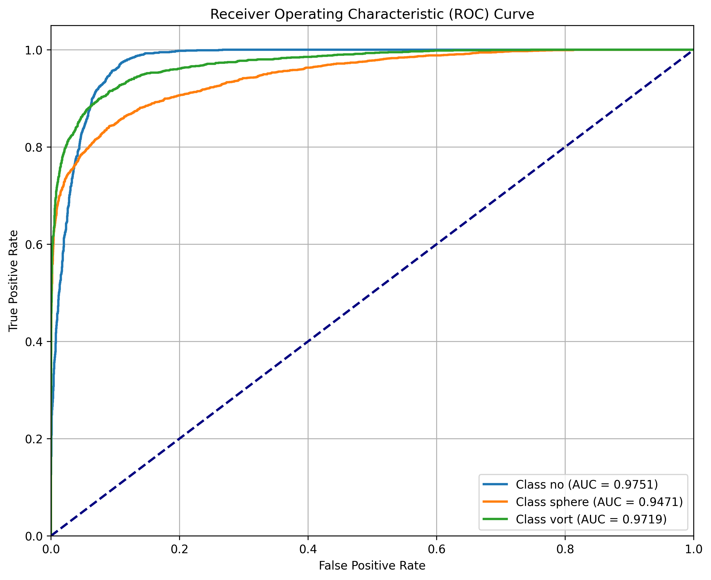

# Strong Lensing Multi-Class Classification

This project implements a deep learning model using PyTorch to classify gravitational lensing images into three categories:
1. **No Substructure**: Strong lensing images with smoothed mass profiles.
2. **Subhalo Substructure**: Lensing images with subhalo perturbations.
3. **Vortex Substructure**: Lensing images with vortex perturbations.

The model used is a modified ResNet-18 (Residual Network with 18 layers), a convolutional neural network (CNN) that uses "skip connections" or "shortcuts" to jump over some layers, helping avoid the vanishing gradient problem, making deeper training possible. More about the model's architecture, see: 
👉 [Model Architecture](model_architecture.md) and what experiments I carried to achieve the project goals with it, see: 
👉 [Experiments & Workflow](experiments.md).

The weights of the best trained model from this exercise are shared in the .pth file, here: https://drive.google.com/file/d/14g2wVViIA6Fc4Kh9NuC__pGCYg0tckrf/ 

## Dataset
The dataset consists of normalized gravitational lensing images in the three categories, provided as `.npy` files.

## Project Structure
- `dataset.py`: Custom PyTorch `Dataset` to load `.npy` images.
- `model.py`: ResNet18 model modified for 1-channel grayscale input and 3-class output.
- `train.py`: Script to train the model and save the best weights.
- `evaluate.py`: Script to evaluate the model on the validation set and generate ROC curves.
- `model_architecture.md`: Detailed description and mapping of the neural network.
- `model_architecture.png`: Visual diagram of the ResNet-18 architecture.
- `experiments.md`: Documentation of experimental hypothesis, tuning, and insights.
- `requirements.txt`: Python dependencies.
- `best_model.pth`: Saved weights of the trained model.
- `roc_curve.png`: ROC curves for the three classes.

## Model Architecture

For a detailed breakdown of the modified ResNet18 architecture, see:
👉 [Model Architecture](model_architecture.md)

## Best Model Weights

Weights of the best trained model from this exercise are shared in the .pth file, here: https://drive.google.com/file/d/14g2wVViIA6Fc4Kh9NuC__pGCYg0tckrf/ 

## Experiments & Workflow

In the 👉 [experiments.md](experiments.md), I detail the strategic approach and steps I followed to achieve the multi-class gravitational lensing images classification. I elaborate upon the model design choices, baseline configuration, modifications, hyperparameter optimizations, training behavior, diagnostics and failure analysis.

## Features
- **Transfer Learning**: Uses a pre-trained ResNet18 backbone.
- **Custom Input**: Adapted to handle single-channel `.npy` data.
- **Evaluation**: Multi-class ROC curve analysis with AUC scores.

## Usage

### 1. Install Dependencies
```bash
pip install -r requirements.txt
```

### 2. Training
Run the training script (ensure the dataset path in `train.py` is correct):
```bash
python train.py
```

### 3. Evaluation
Generate metrics and ROC curves:
```bash
python evaluate.py
```

## Results
The model achieves high AUC scores across all categories:
- **No Substructure**: ~0.975
- **Subhalo Substructure**: ~0.947
- **Vortex Substructure**: ~0.972


