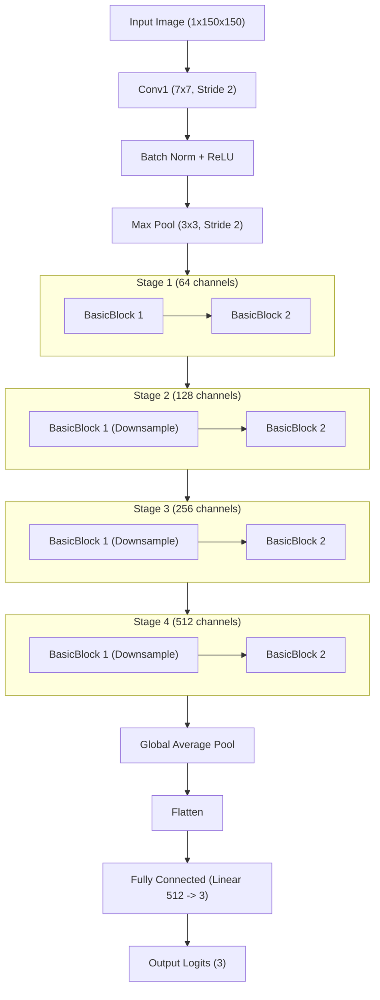

# ResNet18 Model Architecture for Lens Classification

The model used is a modified **ResNet-18 (Residual Network with 18 layers)**. It is a convolutional neural network (CNN) that uses "skip connections" or "shortcuts" to jump over some layers, which helps avoid the vanishing gradient problem and allows for deeper training.

## Architectural Description

1.  **Input Layer**: Accepts grayscale images of size `(N, 1, 150, 150)`, where `N` is the batch size.
2.  **Modified Entry Convolution (`conv1`)**:
    *   **Original**: 64 filters, `7x7` kernel, stride 2, padding 3 (expects 3-channel RGB).
    *   **Modified**: Changed to accept **1-channel grayscale** input.
3.  **Basic Blocks**: The network consists of 4 main stages, each containing 2 "Basic Blocks".
    *   Each **Basic Block** has two `3x3` convolutional layers.
    *   **Skip Connections**: The input of each block is added to the output of the two convolutions.
4.  **Global Average Pooling**: Reduces the spatial dimensions `(H, W)` to `(1, 1)` per feature map.
5.  **Modified Fully Connected Layer (`fc`)**:
    *   **Original**: Linear layer with 512 input features and 1000 output classes.
    *   **Modified**: Linear layer with **512 input features and 3 output classes** (`no`, `sphere`, `vort`).

## Architectural Map (Mermaid)

## Layer Summary Table

| Layer Type | Output Shape | Parameters |
| :--- | :--- | :--- |
| **Input** | `(1, 150, 150)` | - |
| **Conv1 (7x7)** | `(64, 75, 75)` | ~3,136 |
| **Stage 1** | `(64, 38, 38)` | ~147,456 |
| **Stage 2** | `(128, 19, 19)` | ~524,288 |
| **Stage 3** | `(256, 10, 10)` | ~2,097,152 |
| **Stage 4** | `(512, 5, 5)` | ~8,388,608 |
| **Global Avg Pool** | `(512, 1, 1)` | - |
| **FC Layer** | `(3)` | ~1,539 |
